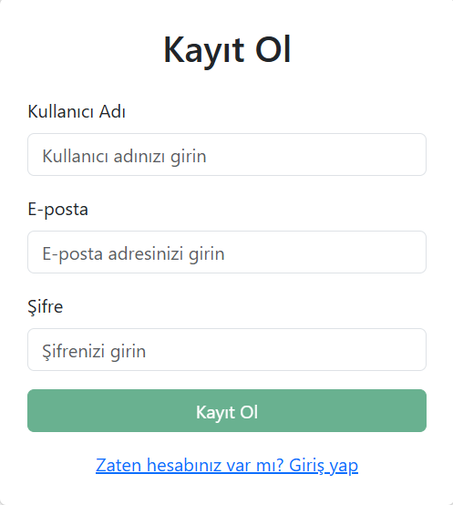
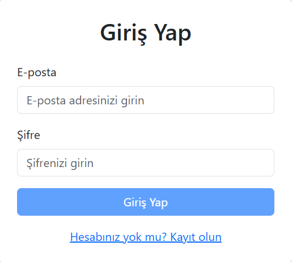
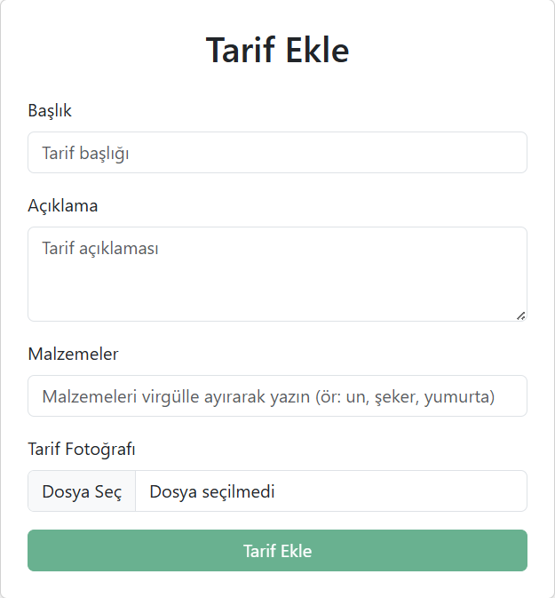
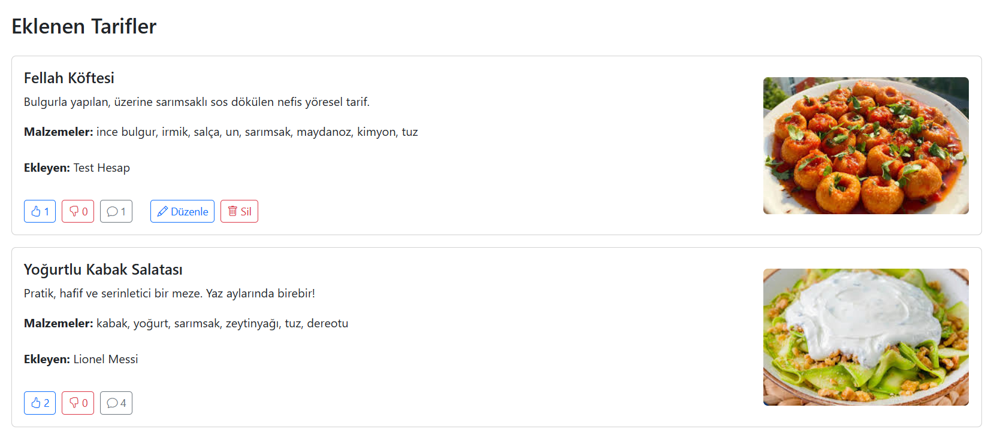
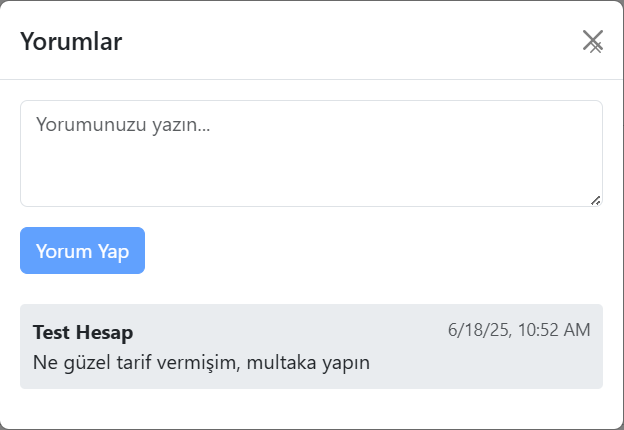
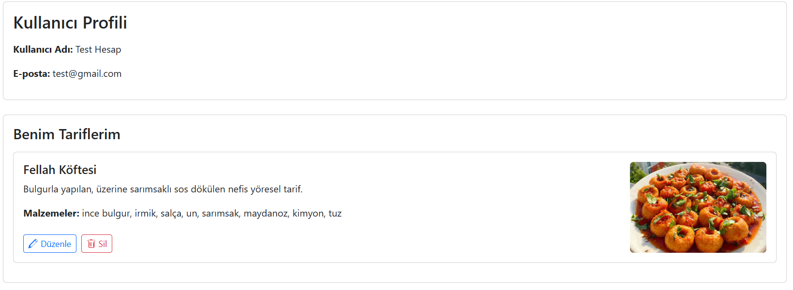

# 🍲 Recipe Sharing Platform

Welcome to the **Recipe Sharing Web App**, a modern and user-friendly platform where users can share their favorite recipes, explore others’ dishes, and get inspired to cook delicious meals. Built using Angular and Firebase, this project is ideal for learning full-stack development and deploying production-ready web applications.

🌐 **Live Demo:** [Click to Visit](https://recipe-f3ccb.web.app)

---

## 🚀 Features

- 🔐 **Authentication System** (Firebase Auth)
  - User registration & login with email and password
- 📤 **Add Recipes**
  - Upload a recipe with a title, description, ingredients, and steps
- 🖼️ **Upload Images**
  - Include a photo for each recipe
- 🔍 **Category Filtering**
  - Browse recipes by categories like Soups, Desserts, Main Dishes, etc.
- ❤️ **Like and Favorite Recipes**
  - Mark your favorite recipes to view later
- 💬 **Comment System**
  - Users can comment on each recipe (coming soon)
- 🌙 **Dark/Light Mode Support**
- 🧑‍🍳 **User Profile Page**
  - See and manage your own shared recipes

---

## 🛠️ Tech Stack

- **Frontend:** Angular 16, TypeScript, RxJS, SCSS
- **Backend/Database:** Firebase Firestore
- **Authentication:** Firebase Authentication
- **Hosting:** Firebase Hosting
- **Media Storage:** Firebase Storage

---

## 📸 Screenshots

### 🔐 Register


### 🔐 Login


### 📝 Add Recipe


### 🍽️ Recipe List


### 🏠 Comment Section


### 🙍 User Profile


---

## ⚙️ Installation

To run this project locally:

1. **Clone the repository:**
   ```bash
   git clone https://github.com/your-username/recipe-sharing-app.git
   cd recipe-sharing-app
   ```

2. **Install dependencies:**
   ```bash
   npm install
   ```

3. **Set up Firebase:**
   - Create a Firebase project at [Firebase Console](https://console.firebase.google.com/)
   - Enable Email/Password authentication
   - Create Firestore and Storage rules
   - Replace `environment.ts` and `environment.prod.ts` with your Firebase config

4. **Run the app locally:**
   ```bash
   ng serve
   ```

---

## 👤 Test Account

You can use the following test credentials to log in and explore the application:

- **Email:** `test@gmail.com`  
- **Password:** `test1234`

---

## ✨ Future Improvements

- Real-time comment and rating system
- Advanced search and filtering
- Admin dashboard for recipe moderation
- Internationalization (multi-language support)

---

## 👨‍💻 Developer

**Developed by:** Enes Yıldırım  
**University:** Atatürk University, Faculty of Applied Sciences, Information Systems and Technologies  
**Course:** Internet-Based Programming Final Project

---

Thank you for checking out this project! ⭐ Feel free to contribute or leave feedback.
